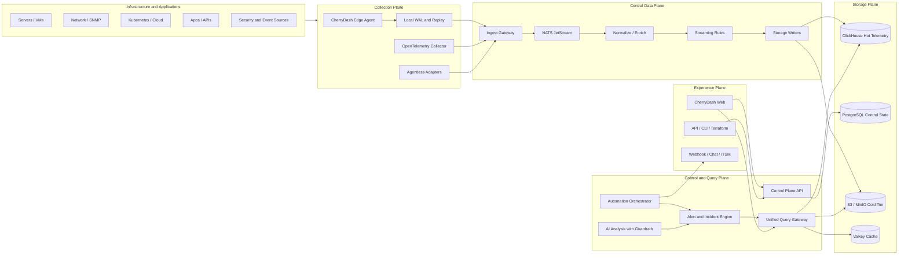

# CherryDash Architecture

เอกสารนี้กำหนดสถาปัตยกรรมเป้าหมายของ CherryDash: แพลตฟอร์มเดียวที่รวมความสามารถด้าน infrastructure monitoring, observability, dashboard, alerting, incident และ automation โดยไม่ผูก core product เข้ากับ codebase ของ Zabbix หรือ Grafana

> สถานะปัจจุบัน: foundation / pre-alpha — ยังไม่มีผล benchmark และตัวเลข scale ที่รับรองได้

## 1. Product thesis

CherryDash ต้องตอบโจทย์สองด้านพร้อมกัน

1. **Monitoring depth** — inventory, discovery, templates, active checks, agentless checks, remote-site collectors, maintenance, trigger, escalation และ reporting
2. **Observability experience** — metrics, logs, traces, events, topology, ad-hoc query, dashboard composition, alert correlation และ SLO/SLA

แนวทางคือสร้าง object model, tenant model, RBAC, audit trail และ incident lifecycle ชุดเดียว แล้วทำ protocol adapter สำหรับ ecosystem ภายนอก

## 2. Logical architecture



## 3. Architectural planes

### Collection plane

- `cherrydash-edge` เป็น binary ขนาดเล็กสำหรับ remote site, branch, customer edge และ air-gapped network
- รองรับ local buffering, back-pressure, replay, remote configuration, signed update และ capability discovery
- ใช้ OpenTelemetry Collector เป็น adapter ecosystem ในช่วงต้น เพื่อไม่เขียน receiver ทุกชนิดใหม่
- native collectors ที่ต้องการ performance หรือ control สูงจะเขียนด้วย Rust เช่น host metrics, network discovery, high-rate event collection และ eBPF sensor

### Ingestion data plane

- Stateless ingress หลาย replica หลัง L4/L7 load balancer
- ยืนยัน tenant, quota, payload size, schema version และ authentication ก่อนรับข้อมูล
- เขียน append-only WAL ก่อนตอบรับในโหมด durable
- ส่งข้อมูลเข้าสู่ NATS JetStream โดยแบ่ง subject ตาม signal, tenant shard และ region
- downstream consumer ต้อง idempotent โดยใช้ `event_id`

### Stream processing

- Normalize resource identity, labels, timestamps และ units
- Enrichment จาก inventory, topology และ ownership
- Deduplication, correlation, rule evaluation และ incident grouping
- แยก processor เป็น consumer group ทำให้ scale ตามชนิดงานได้

### Storage plane

- **ClickHouse**: hot telemetry, event analytics, logs, traces, metric points และ materialized rollups
- **PostgreSQL**: tenants, inventory, monitors, templates, dashboards, alert rules, incidents, RBAC metadata และ audit index
- **S3/MinIO + Parquet**: cold retention, replay bundle, reports, evidence และ long-term archive
- **Valkey**: cache, short-lived coordination, query result cache และ rate-limit state; ไม่ใช้เป็น source of truth

### Control and query plane

- Control API เป็น stateless service; state ทั้งหมดอยู่ PostgreSQL
- Unified Query Gateway แปลง dashboard query ไปยัง ClickHouse, PromQL adapter, external data source หรือ object storage
- Dashboard และ alert ใช้ query model เดียวกัน ลดปัญหา query ทำงานบน dashboard แต่ใช้ใน alert ไม่ได้
- dashboard definition, templates และ alert rules ต้อง export/import แบบ declarative เพื่อรองรับ GitOps

### Automation and AI

- AI ทำหน้าที่ summarize, correlate, propose root cause, recommend query และเสนอ remediation
- AI ห้าม execute การเปลี่ยนแปลงที่มีผลกระทบโดยตรง
- การทำ automation ต้องมี policy, approval, timeout, expiration, rollback, dry-run, separation of duties และ immutable audit evidence

## 4. Language and runtime choices

| Layer | Choice | เหตุผล |
|---|---|---|
| Data plane / agent / high-rate services | Rust + Tokio | low overhead, predictable latency, memory safety, static binary และเหมาะกับ edge |
| HTTP API | Axum + Tower | async stack เดียวกับ Tokio, middleware composition และ type safety |
| Internal RPC/schema | Protobuf + gRPC | versioned contract, code generation และ streaming |
| Query extensions | Apache Arrow / DataFusion | columnar in-memory model และ embedded query engine ใน Rust |
| Web | TypeScript + React + Vite | ecosystem ด้าน dashboard/visualization ใหญ่และหาทีมพัฒนาต่อได้ง่าย |

CherryDash จะหลีกเลี่ยง polyglot backend ในช่วงแรก โดยใช้ Rust เป็นภาษาหลัก เว้นแต่ component ภายนอกที่มี ecosystem แข็งแรงกว่าอย่าง OpenTelemetry Collector

## 5. Multi-tenancy

- ทุก request และทุก telemetry record ต้องมี `tenant_id`
- tenant ถูกตรวจตั้งแต่ ingress และส่งต่อเป็น signed context; ห้ามรับ tenant จาก query parameter อย่างเดียว
- ClickHouse partition/order key เริ่มด้วย tenant shard และ tenant id
- PostgreSQL ทุก business table มี tenant ownership และต้องใช้ application-level authorization รวมกับ database policy ใน production
- NATS subject และ credentials แยก account/tenant group; wildcard permission ต้องปิดโดย default
- quota แยก ingest rate, retained bytes, query concurrency, dashboard refresh และ automation execution

## 6. Scale model

CherryDash ใช้แนวคิด **scale independently by load path**

- เพิ่ม ingest replicas เมื่อ network/event rate สูง
- เพิ่ม consumer groups เมื่อ normalize/rule processing สูง
- เพิ่ม ClickHouse shards เมื่อ storage/query สูง
- แยก query replicas และ cache เมื่อ dashboard concurrency สูง
- เพิ่ม edge collectors ตาม network boundary ไม่ใช่ตามจำนวน host อย่างเดียว
- ใช้ NATS cluster ภายใน region และ super-cluster/gateway ระหว่าง region แทนการ stretch consensus cluster ผ่าน WAN

ตัวเลข performance ต้องมาจาก benchmark suite และ production-like dataset เท่านั้น ห้ามใช้ตัวเลขประมาณเป็น product claim

## 7. Availability model

- Control API และ Query API: stateless, active-active
- PostgreSQL: HA ผ่าน managed service หรือ Patroni-compatible deployment
- ClickHouse: replicated tables + distributed tables, อย่างน้อย 2 replicas ต่อ shardใน production
- NATS JetStream: 3 หรือ 5 nodes ต่อ region และ replication factor 3 สำหรับ stream สำคัญ
- Edge: store-and-forward เมื่อ WAN ล่ม พร้อม bounded disk policy และ replay watermark
- ทุก component มี readiness, liveness, internal telemetry และ graceful shutdown

## 8. Security baseline

- mTLS ระหว่าง edge, ingest และ internal services
- OIDC/SAML/LDAP integration; local break-glass account ต้องถูก audit
- per-tenant and per-service credentials; short-lived tokens เมื่อทำได้
- secret reference ไม่เก็บ secret plaintext ใน dashboard/template definitions
- payload size limit, rate limit, schema validation และ decompression bomb protection
- signed agent packages, staged rollout และ rollback
- audit log แบบ append-only พร้อม hash chaining หรือ external immutable sink
- SBOM, dependency scanning, container signing และ reproducible release pipeline

## 9. Repository shape

```text
agents/        edge and native collectors
crates/        shared Rust libraries and schemas
services/      central control/data-plane services
web/           CherryDash user experience
deploy/        Compose, containers, SQL, future Helm charts
docs/          architecture, ADRs, compatibility, roadmap
proto/         versioned internal/public contracts
```

## 10. Immediate next implementation slice

1. NATS JetStream publisher and WAL replay worker
2. ClickHouse writer consumer with idempotency and batching
3. PostgreSQL repository layer and tenant APIs
4. OTLP HTTP/gRPC receiver
5. Prometheus remote-write receiver
6. Edge enrollment, mTLS identity and local durable queue
7. Dashboard persistence and live overview queries
